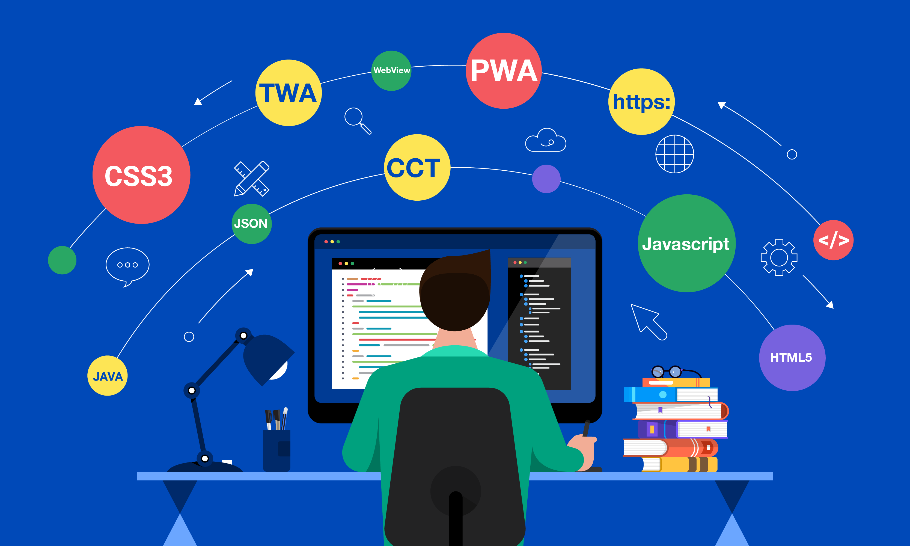
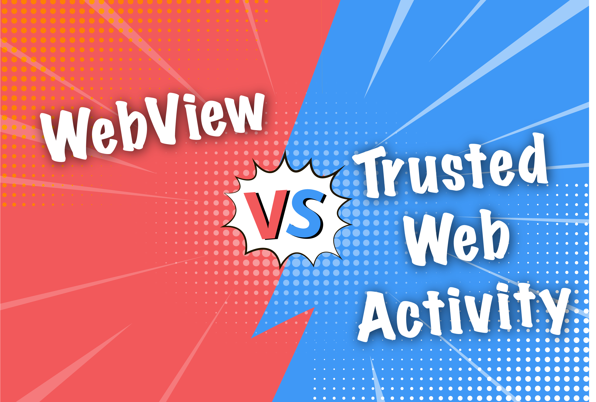
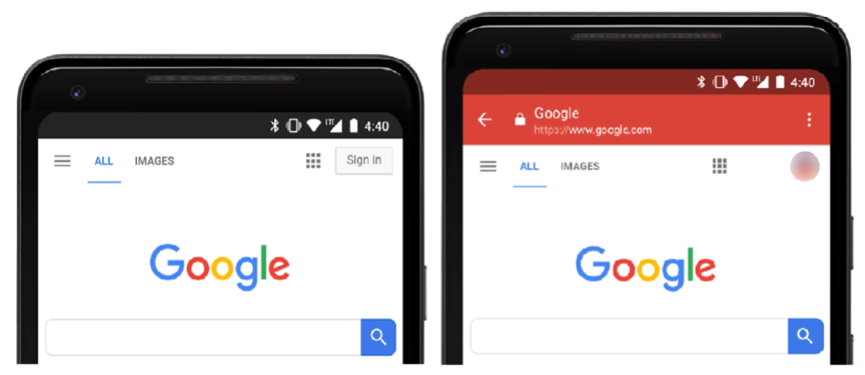

# Publish Trusted Web Activity PWA App to Android App Store 

### Introduction	

A plethora of articles exist that explain the purpose of Progressive Web Apps, Chrome Custom Tabs, and Trusted Web Activities along with how to publish a PWA to the Android platform. In particular, the focus of this article is to explain how a developer (or website owner) can better leverage their existing PWA website by generating a TWA and publishing it to Android. Other than providing a good user experience and security, making a PWA available through an Android app store opens up a completely new channel of discovery for new users which boosts traffic to the website using existing resources and minimal additional effort. 

### What is a TWA?

Modern websites often come with mobile-friendly UI and features that come pretty close to native Android apps. Much effort has been undertaken to reduce the gap between the web and Android to further improve the user experience on websites. Even with the introduction of PWAs which feature advanced functionality such as push notifications, background service workers, and offline capability, it’s still very obvious to the user when content is provided through the web versus an Android app. First and foremost, the address bar is clearly visible at the top of the screen, taking up precious screen real estate. Additionally, web apps are discovered and accessed by users in completely different ways from Android apps. App stores make it very easy for users to discover new apps, but this is not possible for web apps as they are not discoverable on Android app stores. If developers do choose to wrap their PWAs into an Android app and display the web content using a WebView, the result was often much less than ideal, as WebViews do not receive the same level of updates and cannot provide the same user experience as web browsers.  

This is where [Trusted Web Activities](https://developer.chrome.com/docs/android/trusted-web-activity/) come into play. TWAs are a great way to take existing web content and publish them into Android app stores without any additional development effort. Under the hood, TWAs are a more advanced version of Android Custom Tabs ([Chrome Custom Tabs](https://developer.chrome.com/docs/android/custom-tabs/)) that directly make use of the phone’s default browser; this results in the exact same user experience. But unlike CCTs, TWAs can display the web content in full screen without the address bar at the top, making it look more appealing like a regular app to the user. Once the app is published, all the developer needs to do is continue maintaining the website. There’s no need to constantly update the Android app, as the content on the TWA is directly linked to the existing website. This makes it simple for people who already have websites to enter the Android marketplace.

### WebViews vs Trusted Web Activities

Before the advent of [TWAs](https://blog.chromium.org/2019/02/introducing-trusted-web-activity-for.html), Android WebViews was the primary method used to display web content on Android apps. The first iteration of PWA APKs also used WebViews to display web content, but this approach comes with many shortcomings in comparison to the latest PWA APKs generated by pwabuilder.com that use TWAs. WebViews are often unable to deliver the same level of user experience that web browsers are capable of, with [many web experiences being buggy or outright unusable when loaded through WebViews](https://research.google/pubs/pub46739/). 

One of the small positives of a WebView is that the navigation bar is not displayed like it is on a web browser. With CCT, the navigation bar clearly indicates to the user that they are interacting with web content. Having the navigation bar visible on a PWA takes away from the user experience by reducing the overall available screen space and making it less seamless than a native Android app. With TWA, Developers can resolve this issue of hiding the navigation bar by setting up an [`assetlinks.json`](https://developers.google.com/digital-asset-links/v1/getting-started), which securely establishes that they own both the web content and the PWA. Only the website owner can hide the navigation bar of a TWA pointed at their website by matching the certificates, hence the name “Trusted Web Activities”. 

### Trusted Web Activity

* TWA is an extension of CCT with a built-in method of visually indicating to the user that the app developer also owns the displayed web content.
* TWA checks for fingerprint in [`assetlinks.json`](https://developers.google.com/digital-asset-links/v1/getting-started) at specified URL and hides the navigation/address bar if app and website fingerprint match.
* A recommended option for publishing website to Android app store.

| Pros      | Cons    |
| :---      | :---    |
| **Browser experience.** TWA implementation is basically the default browser. The user gets the same experience as the browser which is much better than what WebView can deliver.      |   **No UI control.** UI cannot be changed or adjusted. Additional UI layers cannot be placed on top of TWA.            |
|   | **No callbacks.** TWA does not provide methods to get real-time current URLs or JS events.           |

### WebView
* While Android WebView allows for greater development options and integration with the native Android layer, it comes with many performance issues and security drawbacks.
* Not recommended for taking website as is to Android app store.

| Pros      | Cons    |
| :---      | :---    |
| **UI Customizations.** The WebView is a View object and can be customized like one. | **No browser features or maintenance.** Browser applications like Chrome benefit from all the newest features and updates. These improvements are not available to WebView. |
| **Control.** It’s possible to change the UX or adjust how the user interacts with it. Additional UI layers can be placed on top of the WebView (Ads).| **No safety.** Harmful URLs are not automatically checked as it would in a browser. This is the responsibility of the developer. |
| **Callbacks.** WebView provides methods to get the current URL in real-time as well as JS events. | **More error-prone.** Loading of HTML, CSS, and JavaScript may not be consistent with browser experience and can have undesired results. |

### TWA vs Native Apps

It’s usually the case that native apps have better conversion rates with users that stick around longer than web apps, but this gap can be greatly reduced by using TWA. Publishing a TWA can result in a [3x greater conversion](https://tech.oyorooms.com/a-complete-guide-to-trusted-web-activity-twa-oyo-case-study-3dd327d7afc5) compared to the website alone and can even yield similar conversion performance to that of a native app. In addition to having features that bridge the gap between web and native which keep users around longer, TWAs are easier to maintain on Android app stores. 

**Similar Capabilities to Native**

* **App Icon:** TWA apps are technically Android apps and can be launched from the home screen like any other native app.
* **Offline Capability:** As long as a service worker is configured to cache data, the TWA will have some functionality offline.
* **Fast Performance:** Service worker caching not only enables offline mode, but also improves load times by reducing re-downloading of assets.
* **Push notifications:** PWAs can keep users engaged better than regular websites.
* **Deep linking:** Specific pages on the website can be opened on the TWA app.
* **Fullscreen Display:** Compared to running on the web browser, TWA apps can run full screen (with asset links configured) just like native Android apps.

**Better Capabilities than Native**

* **Instant updates:** Updates pushed to the website are immediately reflected on the TWA without the need to submit a new version to the Android app store.
* **Version compatibility:** The TWA does not run any Android APIs, so there will be no conflicts or compatibility issues to check for as long as the original website runs smoothly on the web browser.
* **Download size:** Since TWA apps point to a URL and run webpages on a browser, the TWA APK has almost no code compared to a native app and the download size comes out to less than 1MB.

### User Experience

The purpose of a PWA is to deliver a web app that gives the user an experience similar to that of a native Android app. From that perspective, hiding the navigation bar and making full use of the available screen space makes the most sense (Figure 1). Without the navigation bar, the displayed web content looks and feels more like a native Android app. Additionally, removing the navigation bar increases the display space of the web content past what is usually available even on a web browser.

When web content is loaded through a WebView, the user experience is often degraded and sub-par to the web browser. Moving forward, web browsers will continue to receive updates while WebViews will not, further increasing the experience gap between them. This has already happened to software support for features like Facebook and Google login; features that are vital to maintaining the experience that users have grown accustomed to. Beginning in October 2021, [Facebook deprecated support for its login feature on WebViews](https://developers.facebook.com/docs/facebook-login/android/deprecating-webviews). For these reasons, it is important that we support TWAs for PWA APKs.

*Figure 1. Nav bar hidden vs visible with CCT*

### Security

When the [`assetlinks.json`](https://developers.google.com/digital-asset-links/v1/getting-started) is setup correctly with a TWA APK, the navigation bar will be hidden (Figure 1) on the content provider’s domain and will be visible on all other websites (Figure 1). This behavior establishes a clear boundary between content from the actual content provider and 3rd party content that the user might get redirected to. For the user, this navigation bar behavior shows which of the displayed content belongs to the content provider and by extension which content they can trust. 

From a software perspective, TWAs are far safer than using the older Android WebView, because it runs off of the actual web browser itself. The browser will receive the latest security fixes and stay up to date. Furthermore, this layer of separation between the web instance and the app prevents black hat developers from obtaining event data or [inserting their own JavaScript](https://medium.com/@skywall/inject-js-into-androids-webview-8845fb5902b7). This ensures that users’ sensitive information stays [protected](https://plaid.com/blog/securing-webviews-with-chrome-custom-tabs/) and private. TWA PWAs are more secure from both a user and technical perspective.

### Which websites should consider publishing as TWA PWA APK?

TWA is a great way for developers that have an existing website, to gain entry to the Android app marketplace. It’s a low-cost, and quick option that makes use of existing assets. Assuming that the website passes all the PWA criteria and app store rules, there are additional considerations that a developer should consider when trying to publish a TWA.

#### 👍 Yes, should consider.

* Mobile-friendly, responsive web layout.
* Developers have limited or no resources to develop and maintain a native Android app.
* Developers update the website frequently and support web users.
* Developers are okay with making some minor changes, fixes to the website like detecting TWA and hiding Google Play Store links.
* Developers do not require native Android capabilities like in-app purchases, accurate location, Android API, etc.

#### ❌ No, should not consider it.
* Developers don’t have a mobile-friendly, responsive layout website.
* Developers must use advanced native Android API within the app.
* Developers do not have enough resources or no motivation to continue website development and support.

### PWA APK Tools

[PWABuilder.com](https://www.pwabuilder.com/) is an online build tool that takes websites that meet the PWA standard and wraps them into a PWA APK powered by TWA. Websites are scanned to check if they meet PWA criteria; only websites with a passing score can be used to generate a TWA. Generally, this means websites that are built for mobile devices which feature mobile-friendly UI, push notification capability, and can run offline with service workers. The biggest advantage to using [PWAbuilder](https://medium.com/pwabuilder/building-a-drawing-pwa-with-pwabuilder-3f4cccdfee9e) is that little to no technical expertise is required to build a PWA APK. There is no coding involved which makes it possible for even non-technical people to generate PWA APKs quickly and easily without the need for an IDE.

While PWAbuilder.com makes it easy for most people to package a website in an APK, it’s probably not the best option if a developer wants to make any additional changes. In this case, the recommended approach is to use [Bubblewrap](https://github.com/GoogleChromeLabs/bubblewrap) to generate the TWA via the command-line interface. For some background, [Bubblewrap](https://github.com/GoogleChromeLabs/bubblewrap) is the tool that generates the APK behind the scenes for PWAbuilder.com, just without the fancy UI.

### Conclusion

Moving from the web to Android and creating an entirely new application can be a daunting task that takes considerable development resources. Alternatively, a great option that greatly reduces the work involved and still yields the same user experience is to build an app powered by a Trusted Web Activity. Unlike the old method of using an Android WebView, TWAs provides a superior user experience since the webpage is loaded using the default web browser which is more stable and secure; the web app will run exactly as intended. Taking it further, developers can make the process even easier by using PWABuilder (or Bubblewrap for more advanced users) to generate their TWA APK. With these resources and support, it’s currently much easier for developers to take their web apps into the Android app store. Without any real maintenance effort required, a world of potential awaits developers that decide to take the plunge and turn their PWA into a TWA.
