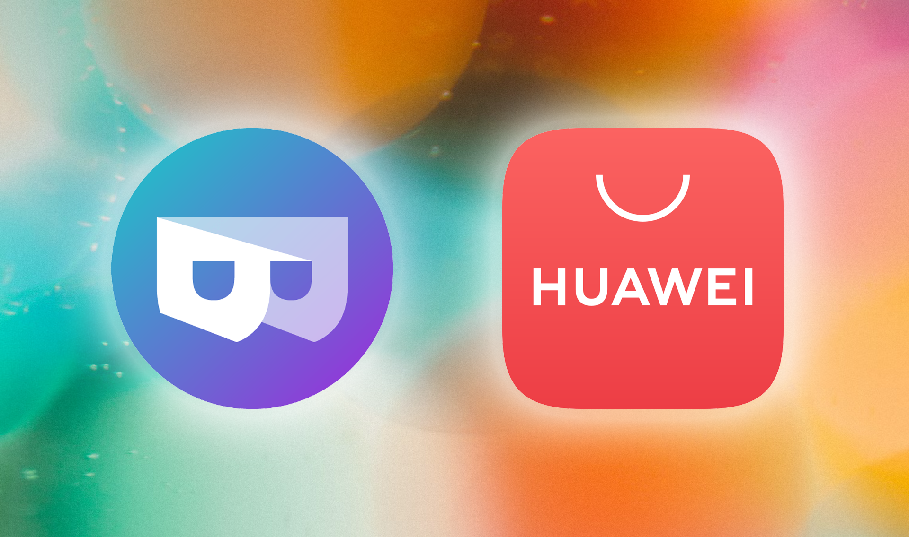

# AppGallery Support PWABuilder APK

Last updated on 2/1/2022

We’re excited to announce a new collaboration between **PWABuilder** and **Huawei AppGallery** for the benefit of the web and Android developer community. AppGallery fully supports **[PWA web standards](https://web.dev/progressive-web-apps/)**. Huawei Developers can now use PWABuilder to package their PWA web apps as a native app and publish to the AppGallery.

We understand that maintaining your content on multiple platforms can be quite a task. With PWABuilder, existing web content can be published to AppGallery quickly and easily without additional development effort. Once your PWA Android app is published, all you need to do is continue maintaining your website. There is no need to constantly update the Android app, as the content is directly linked with your existing PWA.

**[PWABuilder](https://pwabuilder.com/)** is an open-source developer tool that helps you build high-quality PWAs and publish them to app stores. No technical expertise is needed to build an Android package.

**[AppGallery](https://consumer.huawei.com/en/mobileservices/appgallery/)** is Huawei’s official app distribution platform and one of the top 3 app stores worldwide. Publishing your PWA to AppGallery creates a new channel to reach and promote your apps to Huawei’s 580 million global monthly active users in over 170 countries.

**Advanced Android features & customization:** PWABuilder now supports the full range of trusted web activity (TWA) options that make your PWA shine on Android devices and bring it closer to the native Android experience. From PWABuilder, you can customize the appearance of the Android status bar and nav bar in your PWA, customize your Android splash screen, change your launcher name, use an existing signing key, utilize deeper push notification support, configure your package’s ID and versioning, fallback behavior and more.

Check out how to easily publish your PWA on AppGallery using the safe open-source Bubblewrap tool. Follow the step-by-step guide in this blog to [generate your AppGallery package with PWABuilder](https://consumer.huawei.com/en/mobileservices/appgallery/), deploy, test, and publish your PWA to Huawei AppGallery.

Learn more at **[AppGallery PWA Supporting Guide](/appgallery-platform-supporting-pwa.md)**.

**Links**

1. [AppGallery PWA Supporting Guide](appgallery-platform-supporting-pwa.md)
2. [How to Generate a PWA Android package for Huawei AppGallery](how-to-generate-pwa-android-package-for-huawei-appgallery.md)
3. [Testing and publishing your app to the Huawei AppGallery](testing-and-publishing-your-app-to-huawei-appgallery.md)
4. [Updating your existing app](updating-your-existing-app.md)
5. [Removing the Browser Address Bar: Asset Links](removing-the-browser-address-bar.md)
