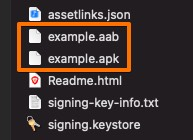
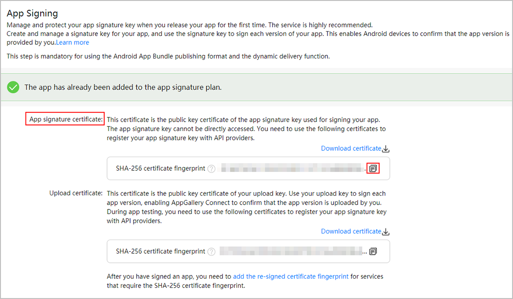
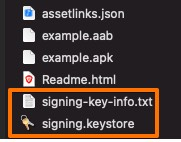

#Testing and publishing your Android PWA to Huawei AppGallery

Last updated on 2/1/2022
 

First, to generate your AppGallery package with [PWABuilder](https://www.pwabuilder.com/)

Your next steps:

1.	**Create and upload `assetlinks.json` to your server** to prove domain ownership.
2.	**Test your app**: install and open the .apk file on a Huawei device.
3.	**Submit your app to Huawei AppGallery**: upload the .apk or .aab file to Huawei AppGallery.
4.	**Update `assetlinks.json` for production**: after AppGallery signs your app, you’ll need to update your asset links to remove the address bar from your app. This step is optional if you use [AppGallery Connect App Signing](https://developer.huawei.com/consumer/en/doc/development/AppGallery-connect-Guides/agc-appsigning-newapp-0000001052418290) service. You can skip this step if you sign your own APK package.

Each step is explained below.

1.	**Deploy `assetlinks.json`**

	Your zip file contains assetlinks.json. This is a digital asset links file that proves ownership of your PWA. Upload this file to your server at `https://example.com/.well-known/assetlinks.json`. (Replace example.com with your PWA’s URL.)
Important:
**Digital asset links are required for your PWA on Android.**

	If you’re seeing a browser address bar in your app on Android, or if your app is crashing on launch, it means your assetlinks.json file is missing, inaccessible, or incorrect. See the [official digital asset links doc](https://developers.google.com/digital-asset-links/v1/getting-started) to learn more.
	
2.	**Test your app on a Huawei device, Huawei Cloud Debugging, or Android emulator**

	Your zip file contains an `.apk` (Android Package) file, which can be loaded on your Huawei device, Android emulator or cloud debugging device.
	
	**To test your app, install open the .apk file on your Huawei device, Huawei Cloud Debugging, or Android emulator.**
	
	If you don’t have a physical Huawei device, you can use the [Cloud Debug feature available on the AppGallery Console](https://developer.huawei.com/consumer/en/doc/development/AppGallery-connect-Guides/agc-clouddebug-introduction-0000001057034023#section3775155131016) that lets you test your apps on real devices. Alternatively, you can use the free [Android Emulator included in Android Studio](https://developer.android.com/studio/run/emulator). Run the emulator and open the `.apk` file to install your app. You can also drag and drop the .apk file onto the Android emulator to install it.
	
3.	**Upload your app to the Huawei AppGallery**

	Your zip file contains both `.aab` (Android App Bundle) and `.apk` files which can be submitted directly to AppGallery through the [AppGallery Connect Console](https://developer.huawei.com/consumer/en/doc/distribution/app/agc-help-configure-appinfo-0000001100086630).

 
 
	Once you submit your app, it will be reviewed. Once approved, your PWA app will be available in the Huawei AppGallery.

4.	**Update your asset links file for production**
Note:
This step is required for running the production version of your app. If you skip this step, your app will crash or will a browser address bar will appear inside your app. See [asset links doc](https://developers.google.com/digital-asset-links/v1/getting-started) for more info.

	Once you’ve uploaded your `.aab` file, Huawei AppGallery re-signs your app. Because of this, you’ll need to update your asset links file.
	
	To update your asset links and remove the address bar from your app, login to the Huawei AppGallery Console > select App > App Signing, then copy your SHA-256 fingerprint (see [Configuring the New Certificate Fingerprint](https://developer.huawei.com/consumer/en/doc/development/AppGallery-connect-Guides/agc-appsigning-newapp-0000001052418290#section1959661616436)):
 
	
 
	Please paste the fingerprint into your `assetlinks.json` file:

		[
			{
				"relation": ...,
				"target": {
				"namespace": ...,
				"package_name": ...,
				"sha256_cert_fingerprints": [
						"...",
						"PASTE YOUR NEW SHA-256 FINGERPRINT HERE"
					]
				}
			}
		]

	Once your updated `assetlinks.json` file is deployed to your server, the address bar will disappear from your app.

	**Please note:**
	
	On the Huawei Browser, the address bar will still be visible even when the asset links file is correctly set up. The address bar will only disappear on Huawei devices with Google Chrome.

**Save your signing key**

Your zip file contains `signing.keystore` and `signing-key-info.txt`:

 
* **`signing.keystore`** is the Android key store file containing the signing key.
* **`signing-key-info.txt`** is a text file containing your signing key information, such as the key password, store password, and key alias.

Keep both of these files in a safe place. You’ll need them to deploy future versions of your app.

**Updating an existing app in AppGallery**

Have an existing app in the Play Store and want to update it to a new version? No problem!
See updating an existing app.

**Note about Quality Criteria on Android**

As of Chrome 86, PWAs downloaded from the Huawei AppGallery will now crash if your app:

* Does not have a valid TLS certificate
* Does not link to your digital assetlinks file correctly

Because of this, you should ensure that your PWA runs on an HTTPS domain and has your assetlinks file properly linked.

For more info about Chrome’s quality criteria policy, check out [this article](https://blog.chromium.org/2020/06/changes-to-quality-criteria-for-pwas.html) from the Chrome team.

**Need more help?**

If the browser address bar is showing up in your app, see PWABuilder GitHub [asset links helper](https://github.com/pwa-builder/CloudAPK/blob/master/Asset-links.md). Keep in mind that the address bar will still be visible when using the Huawei Browser.

The information on this page is sourced from [PWABuilder.com blog](https://blog.pwabuilder.com/docs/testing-and-publishing-your-android-pwa-to-the-google-play-store).

